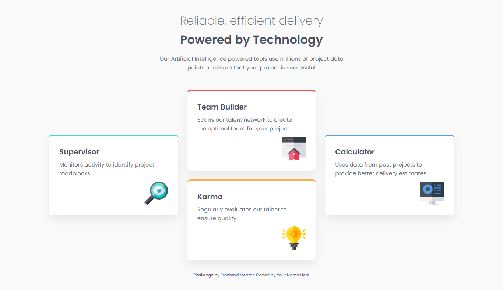

# Frontend Mentor - Four card feature section solution

This is a solution to the [Four card feature section challenge on Frontend Mentor](https://www.frontendmentor.io/challenges/four-card-feature-section-weK1eFYK).

## Table of contents

- [Overview](#overview)
  - [The challenge](#the-challenge)
  - [Screenshot](#screenshot)
  - [Links](#links)
- [My process](#my-process)
  - [Built with](#built-with)
  - [What I learned](#what-i-learned)
  - [Continued development](#continued-development)
- [Author](#author)
- [Acknowledgments](#acknowledgments)

## Overview

### The challenge

Users should be able to:

- View the optimal layout depending on their device's screen size

### Screenshot

### Links

- Solution URL: https://www.frontendmentor.io/solutions/responsive-four-card-page-design-built-using-grid-flexbox-and-CgZwrrfK98
- Live Site URL: https://chikamsodev.github.io/four-card-feature-section-master/
## My process

- Built the layout with semantic HTML first (header + cards section)
- Reset default browser spacing and set up CSS variables for colors + radius
- Used CSS Grid for the overall card layout (mobile-first)
- Used Flexbox inside each card to push the icon to the bottom
- Matched the top border colors using `border-top-color`

### Built with

- Semantic HTML5 markup
- CSS custom properties
- Flexbox
- CSS Grid
- Mobile-first workflow

### What I learned

- `width: min(1100px, 100%)` for a clean responsive container
- Using `border-top-color` + a transparent border to style only the top edge
- Combining Grid (layout) + Flexbox (card internal alignment)

### Continued development

I want to keep improving my spacing and typography, and get more confident with Grid layouts.

## Author

- Portfolio: https://chikamsodev.github.io/Personal-Portfolio/
- GitHub: https://github.com/ChikamsoDev
- Frontend Mentor: https://www.frontendmentor.io/profile/ChikamsoDev

## Acknowledgments

Challenge by Frontend Mentor. Built with help from ChatGPT.
